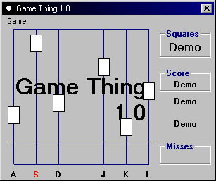



## Game Thing 1\.0

### Description

This is just a simple little game I made. You have to hit the right key (shown at the bottom - A,S,D,J,K,L) anytime after the block gets by the red line. But make sure it doesn't hit the bottom or it's game over! Sound easy right? Wrong - it gets harder. If the block turns red you have to hit the key 2x!!! Wow. Heheh, give it a try and let me know what you think.
 
### More Info
 

             |
---                |---
**Submitted On**   |2001-01-07 17:59:58
**By**             |[MaskingTape](https://github.com/Planet-Source-Code/PSCIndex/blob/master/ByAuthor/maskingtape.md)
**Level**          |Beginner
**User Rating**    |4.3 (17 globes from 4 users)
**Compatibility**  |VB 6\.0
**Category**       |[Games](https://github.com/Planet-Source-Code/PSCIndex/blob/master/ByCategory/games__1-38.md)
**World**          |[Visual Basic](https://github.com/Planet-Source-Code/PSCIndex/blob/master/ByWorld/visual-basic.md)
**Archive File**   |[CODE\_UPLOAD13507172001\.zip](https://github.com/Planet-Source-Code/maskingtape-game-thing-1-0__1-14227/archive/master.zip)

